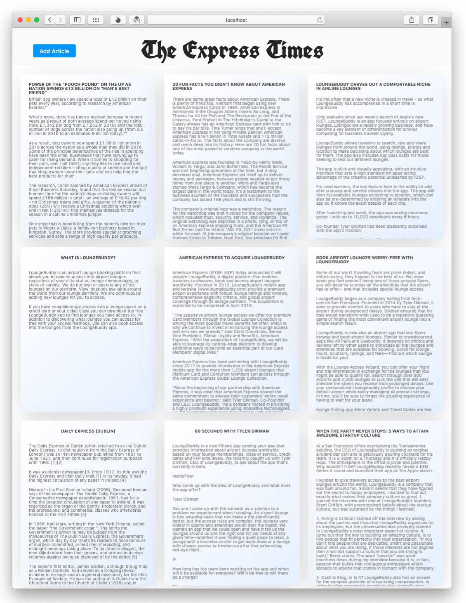
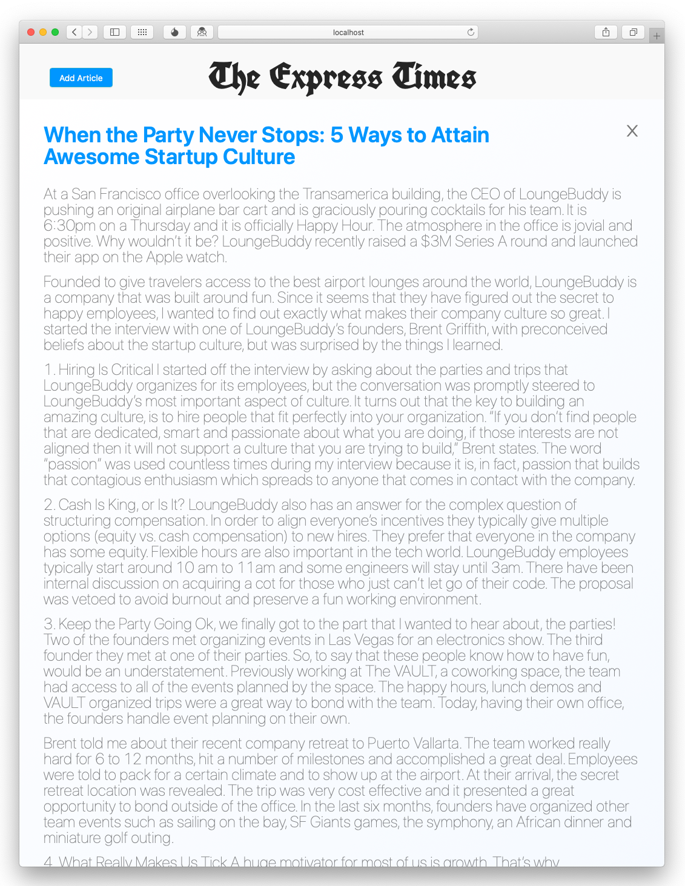
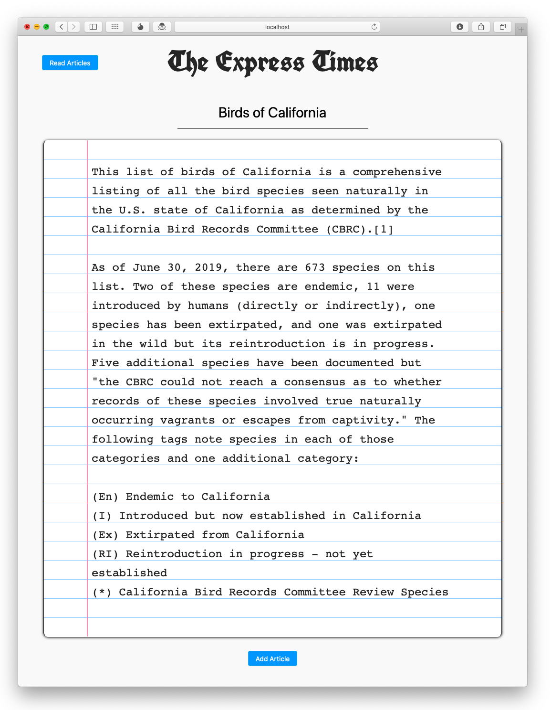

# The Express Times
A newspaper GET/POST example in the JavaScript React stack.

A live version of the React App was up on AWS Amplify until November 2022.

## Architecture

A React App connects to AWS Lambda, retrieving and posting articles to a Postgres database.  With the frontend on AWS Amplify and the backend on AWS Lambda, this application is fully in the serverless cloud!

## Lambda
A short Lambda function is used to write and read the Postgres database using [Sequelize](https://sequelize.org).  Lambda function uploading and API endpoint creation was handled with [Claudia.js](https://claudiajs.com).

## React
An existing React [grid component](https://github.com/drcmda/mauerwerk) was further customized to provide display of articles.  This allowed display of the articles in a good-looking format without using a templating engine.

## UI
### Viewing

### Posting

## From Development to Production
I consider this more of a dev project, a tech demo.  If this was going to move to production, even more work would be needed, including:

* Inputs from users would need to be checked to see if they were well-formed and for security purposes, because we are accepting HTML inputs, before passing them along.
* Error handling would need to be added.

In its current form though it does effectively show a methodology for creating GET and POST requests, the primary goal of the task.
